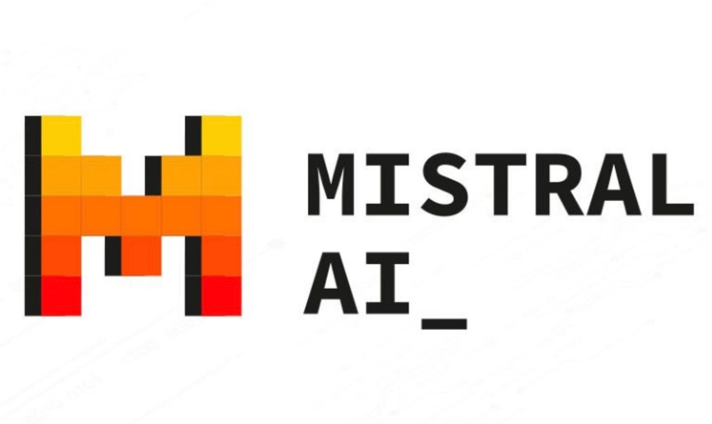
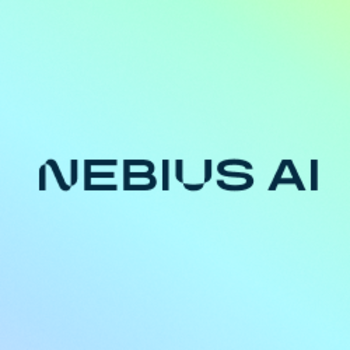
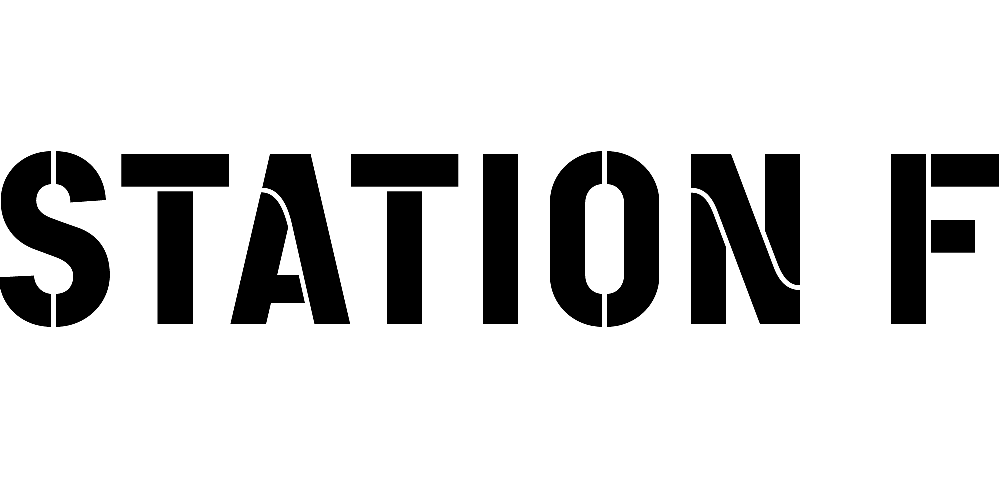

# smol🦎

**smol** is our project for the Mistral AI Hackathon. The project is a platform that allows users to automatically create a small fine-tuned model (Student) from a larger pre-trained model (Oracle) on a specific task. We used an **unseen method of training using a combination of adversarial and curriculum learning to leverage the most out of our datasets to align our model with human preferences.**

**It opens the door to a new and fastest way to create agent specialized in a specific task.**

## Sponsors
## [Groq](https://www.groq.com/)


## [Mistral](https://www.mistral.ai/)


## [Nebius](https://nebius.ai/)


## [Station F](https://stationf.co/)


## Key Features
The core idea involves using a Large Language Model (e.g., Mistral Large) to generate a dataset tailored for fine-tuning a smaller model (e.g., Mistral Small). The small model is then trained using a Direct Preference Optimization (DPO) algorithm. Here's a breakdown of the process:
1. **Initial Dataset Generation**: The large and small model generates a dataset.

2. **First Fine-tuning**: The small model is initially trained on this dataset using the DPO algorithm.

3. **Dataset Refinement**: The large and refined small model generates a new dataset based on the smaller model's worst perfomance by sampling from the worst predictions.

4. **Iterative Fine-tuning**: The small model undergoes further fine-tuning with this new dataset.

5. **Repetition**: Steps 3-4 are repeated until user-defined limits are met.

To summarize, the platform allows users to automatically create a small fine-tuned model from a pre-trained model on a specific task. The user can then use the fine-tuned model by a endpoint give by the platform.


## Participants
- Eithan Nakache
- Martin Natale
- Ilyas Oulkadda
- Camil Ziane

## Installation
This project use python 3.10.12, you can create a virtual environment with the following command:

A Weight And Bias key if you want to have a train report.
Your HuggingFace Read and Write tokens to load the models you want to fine-tune and upload your model on your HuggingFace Hub
Your Groq/Mistral/OpenAI API key for oracles.

```bash
conda create -n smol python=3.10.12
```

Then, you can activate the environment with:

```bash
conda activate smol
```

Create a .env file in the root directory with the following content:

```bash
GROQ_API_KEY=
FIREWORKS_API_KEY=
MISTRAL_API_KEY=
HUGGING_FACE_API_KEY=
```

You can then install the dependencies with the following command:

```bash
pip install -r requirements.txt
```

## Run the project
There are two servers to run. The first one is the server that will receive the requests from the client side and the second one is the server that will run the automatic fine-tuning pipeline.

To run the server that will receive the requests from the client side, you can run the following command:

```bash
streamlit run web/1_🏠_Home.py
```

To run the server that will run the automatic fine-tuning pipeline, you can run the following command:

```bash
python main.py
```